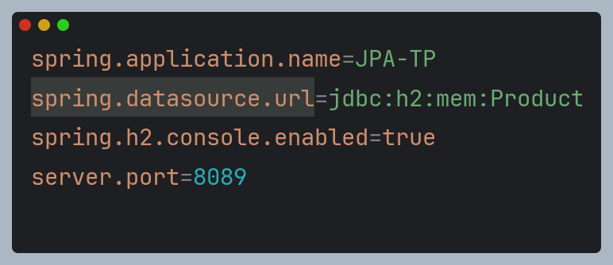

# ORM JPA Hibernate Spring Data
<h2>Structure de projet : </h2>

## Objectif
### Pre-requis : 
1. Installer IntelliJ Ultimate
2. Créer un projet Spring Initializer avec les dépendances JPA, H2, Spring Web et Lombock
## Etapes : 
3. Créer l'entité JPA Product ayant les attributs :
   - id de type Long
   - name de type String
   - price de type double
   - quantity de type int 
   

4. Configurer l'unité de persistance dans le ficher application.properties

5. Créer l'interface JPA Repository basée sur Spring data

6. Tester quelques opérations de gestion de patients :
    - Ajouter des produits
    - Consulter tous les produits
    - Consulter un produit
    - Chercher des produits
    - Mettre à jour un produit
    - supprimer un produit

7. Migrer de H2 Database vers MySQL
    - Ajouter la dépendance MySQL

    - Configurer la base de données dans application.properties

